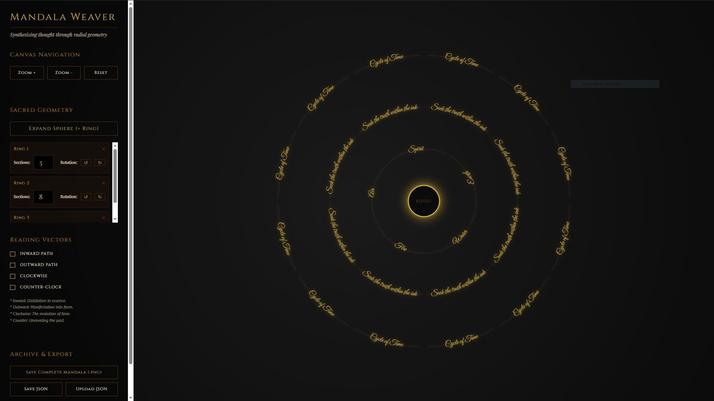

# The Mandala Weaver

> "Synthesizing thought through radial geometry."

## Changing the Perception of Writing

The Mandala Weaver is not merely a drawing tool; it is a fundamental shift in the architecture of human expression. Traditionally, writing is linear—a sequence of symbols marching across a line, bound by the gravity of beginning and end. 

**The Mandala Weaver breaks this line.**

It invites the writer to think in circles, rings, and vectors. It transforms writing from a static record into a dynamic resonance. Here, ideas do not just progress; they orbit, they distill, and they manifest.

---

## Core Philosophy: The Vectors of Thought

Weaving a mandala is an act of "Sacred Inscription." By placing text within radial geometry, we engage with four primary vectors of perception:

*   **Inward Path (The Way of Essence):** Writing towards the center. A process of distillation, where complex ideas are stripped of their noise until they reach the **Bindu**—the central point of pure potential and eternal silence.
*   **Outward Path (The Way of Manifestation):** Writing away from the center. A process of emergence, where a single seed-thought radiates outward into complex forms and detailed expressions.
*   *Clockwise (The Evolution of Time):** Following the natural spin of the cosmos. Writing that tracks the progression, growth, and future-oriented flow of ideas.
*   **Counter-Clockwise (The Involution of Memory):** Unraveling the past. Writing as an act of reflection, deconstruction, and returning to the origins of a thought.

---

## Features of the Sacred Engine

*   **Radial Inscription:** Seamlessly wrap text around circular arcs, maintaining readability through a specialized SVG "flip-prevention" logic.
*   **Spherical Expansion:** Add or remove concentric rings of thought, each with customizable section counts and rotational offsets.
*   **Visual Alchemy:** A premium interface themed in Obsidian, Gold, and Parchment, designed to elevate the user into a state of focused contemplation.
*   **Temporal Animation:** Engage the "Reading Vectors" to see your thoughts physically flow inward, outward, or spin in temporal cycles.
*   **Archive & Export:** Save your thought-structures as `JSON` configurations for future meditation or export high-resolution `PNG` captures.
## ⚡ Support

**Made with ❤️ and ☕ by the Plantacerium**

⭐**Star us on GitHub**⭐

## Meditation on Usage

1.  **Inscribe:** Click any segment of a ring to open the inscription portal and write your thought.
2.  **Expand:** use "Expand Sphere" to create new layers of complexity.
3.  **Navigate:** Use the zoom controls to dive deep into the Bindu or step back to see the entire lattice of your mind.
4.  **Flow:** Toggle the Path indicators to visualize how your narrative moves through space and time.

---

*The Great Silence (Bindu) is Eternal.*
